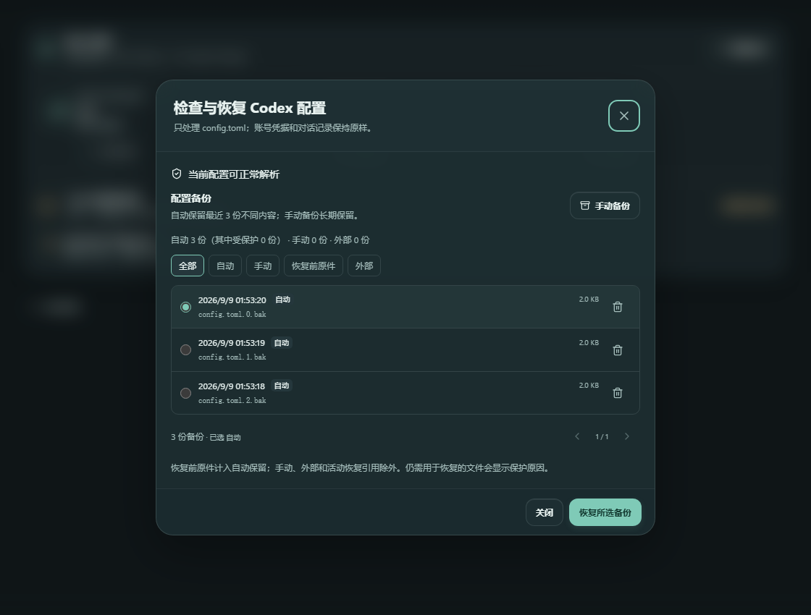

# Agent Manager


**个人练手项目，代码、界面、文档和开发工作由 Codex 完成，仅供个人学习与测试。** 本项目不是 OpenAI、Anthropic 或任何中转站的官方产品，不提供生产服务承诺。

一个面向 Windows 的本地 AI 开发工作台：管理 Codex 账号与 API、组织模型和子代理、维护会话与配置。当前正式版本 **1.0.0**。

[下载安装包](https://github.com/Foxgh127/Agent-Manager/releases/latest) · [版本说明](docs/release-notes.md) · [使用与故障处理](docs/usage.md) · [开发与发布](docs/development.md) · [设计与资料](docs/architecture.md)

## 适合做什么

| 工作区 | 功能 |
| --- | --- |
| 账号与 API | 管理自己的官方账号、API Key 和网页登录中转站；选择 Key、线路、模型与本地分组 |
| 模型与调度 | 设置主模型、按任务难度分配子代理；保留 Codex 原生模式和自定义策略 |
| 本地网关 | 在已授权来源之间路由请求，处理协议差异、上下文和失败后的恢复 |
| 会话维护 | 检查会话可见性、同步与恢复索引；保留原始对话和必要的回滚记录 |
| 配置备份 | 自动保留最近三份不同内容；手动备份、恢复、删除和查看保护原因 |
| 版本与维护 | 查看 Agent Manager、Codex Desktop 与 CLI 的版本，按系统能力检查并更新 |
| 其他工作区 | 保留 Claude 直连配置、雷达、邮箱、2FA 等现有工具 |

1.0.0 保留现有功能，清理历史构建产物、重复文档和废弃脚本。读取旧账号及会话所需的兼容逻辑继续保留，避免整理代码时损坏原有数据。

## 快速开始

1. 从 [Releases](https://github.com/Foxgh127/Agent-Manager/releases/latest) 下载当前版本的 Windows EXE。
2. 将文件放入自己可写的固定文件夹，结束旧版管理器后运行新版。
3. 添加自己的账号或 API，在调度中心选择模型，再保存并同步。
4. 需要退出时使用普通关闭或“彻底退出”；需要保留后台服务时启用托盘。

**从旧 9.x 升级：** 1.0.0 是版本编号重置。旧客户端按数字大小比较版本，因此第一次请手动下载 1.0.0。新系列使用独立的发布代次和缓存标识，避免把旧 9.x 识别成新版本；1.0.0 之后继续支持一键更新。

## 运行环境与不同设备

| 环境 | 说明 |
| --- | --- |
| Windows 10 / 11 x64 | 主要支持环境；便携 EXE 不要求目标设备安装 Python 或 Node.js |
| Windows ARM64 | 可尝试系统的 x64 仿真；尚无原生 ARM64 安装包或实机验证承诺 |
| WebView2 和 .NET | 原生窗口及网页登录使用 WebView2；缺失时管理器主界面可退回默认浏览器，网页登录能力仍需要 WebView2 |
| Codex Desktop / CLI 未安装 | 显示实际缺失状态；按需安装或部署，不假设固定安装路径 |
| Desktop 外部更新 | 需要系统的 Microsoft Store CLI；不可用时明确提示，不伪装成最新版 |
| 自定义位置、空格和中文路径 | 资源定位不依赖当前工作目录，配置路径遵循 `CODEX_HOME` |
| macOS / Linux | 部分纯逻辑可用于开发测试；当前发布包和 DPAPI 凭据存储面向 Windows |

程序资源、临时构建和用户数据分开存放。移动 EXE 不会移动或清空账号数据。跨电脑迁移请使用应用的导入/导出功能；Windows DPAPI 加密内容不能靠直接复制文件夹跨用户解密。

## 关闭与配置恢复

- 普通关闭窗口、彻底退出：确认 Codex 已结束，恢复原始配置并完成回验，再停止管理器。
- 关闭到托盘：保留 Codex 与管理器服务。
- 快速重启：仅交接管理器进程及服务。
- 高级“仅退出软件”：保留 Codex 和临时配置，但停止管理器网关；依赖网关的请求会中断。

发现外部修改、活动任务未结束或恢复不完整时，管理器保留修复入口和恢复记录，不将失败报告为成功。

## 配置备份如何保留

在调度中心点击 **恢复配置**，可以手动备份、按类别查看、恢复或删除备份。列表分页显示，不再使用不断变长的下拉菜单。

自动备份按内容指纹去重，普通修改和恢复前的自动原件共同保留最近三份不同内容。手动备份长期保留，直到用户删除。外部备份和仍被活动/失败恢复事务引用的文件不会自动删除；界面会标明保护原因，因此特殊情况下总数可能暂时超过三份。



## 官网能打开，为什么刷新仍可能失败

网站可以允许已登录浏览器，同时拦截后台 HTTP 客户端。FastAI 的相关问题已确认属于网站验证页，并不是账号余额为零或登录必然过期。

点击 **刷新** 后，管理器会打开 **通过网页刷新** 窗口，请在该窗口完成网站要求的验证。应用核对同一账号后读取余额，并可保留一个隐藏窗口供后续显式刷新复用；切换身份或再次被拒绝时释放该窗口。不会自动破解验证，也不会把挑战 cookie 搬到后台请求中。

如果网站从 `www.example.com` 跳转到 `example.com`，窗口会明确显示地址差异。点击 **使用当前地址重新连接**，按新地址登录并确认导入；原卡片会保留，旧凭据不会自动转送，Chrome 中的登录也不会直接复制进管理器。

余额读取失败时显示“待刷新”和上次读数；API Key 额度不会冒充网站账号余额。Sub2API 返回的日、周、月限制为 0 时表示未设置该周期上限，不显示成“只能使用 0 美元”。

## 切换账号与继续对话

会话维护保留原始对话内容，以可回滚方式修复索引与来源可见性。网关对完整、无状态的历史做协议适配：若上游明确拒绝不兼容的加密推理项，只修改请求副本，并在同一身份上有限重试。

服务端游标、仅有加密压缩状态、缺失的工具调用或已经输出的响应不能可靠移植。此时会保留原历史并给出恢复原来源或提供完整历史的提示，不伪造上下文，也不把失败请求随意换号重放。直连 Codex 的流量不经过本地网关，具体行为也取决于 Codex 与上游支持。

## 开发与构建

建议 Python 3.11+、Node.js 24，并在虚拟环境中开发：

```powershell
python -m venv .venv
.\.venv\Scripts\Activate.ps1
python -m pip install -e ".[build,test]"
npm ci --ignore-scripts --prefix frontend
python scripts/sync_version.py
npm run build --prefix frontend
python -m agent_manager
```

验证与构建：

```powershell
python -m pytest
npm test --prefix frontend
./scripts/build.ps1
```

安装包输出到 `dist/`。项目版本只需修改 `src/agent_manager/_version.py`，同步脚本会生成前端、Windows 文件属性及发布元数据。发布到 `main` 后，GitHub Actions 进行检查、构建、草稿校验和正式发布，无须为客户端填写更新源。

## 项目结构

```text
src/agent_manager/
  application/     窗口、HTTP 接口、任务运行和生命周期
  core/            按主题拆分的配置、账号、模型和事务服务
  accounts/        导入、授权与网页登录
  config/          配置备份和恢复
  gateway/         HTTP / WebSocket 网关
  sessions/        会话索引、可见性与恢复
  updates/         发布检查、下载、安装和 Desktop 更新
  platform/        Windows 能力、窗口和安装路径适配
  integrations/    Claude、雷达和工具箱
  usage/           用量、估算与导出
  resources/       安装包资源
frontend/          React 界面
tests/            按领域组织的回归测试
scripts/           开发、构建、发布和清理命令
packaging/         EXE 入口、DLL 启动钩子和文件属性
docs/             使用、开发、设计及版本说明
```

详细模块责任、公共接口及参考方案见 [架构说明](docs/architecture.md)。

## 数据与项目边界

账号、密钥、OAuth 文件、会话记录和个人备份不放入源码仓库。默认管理器数据位于 `%USERPROFILE%\.codex\agent-manager`；设置 `CODEX_HOME` 后随对应 Codex 目录存放。

项目尚未进行收费模型效果评测或所有设备的实机测试。调度提示词的测试证明配置与契约被正确生成，不代表已测量模型性能提升。[提示词资料与取舍](docs/subagent-policy.md) 提供对应来源。

OpenAI、Codex、ChatGPT、Claude 及相关标识属于各自权利人。第三方依赖遵循其自身许可；本项目与这些产品无官方隶属关系。
